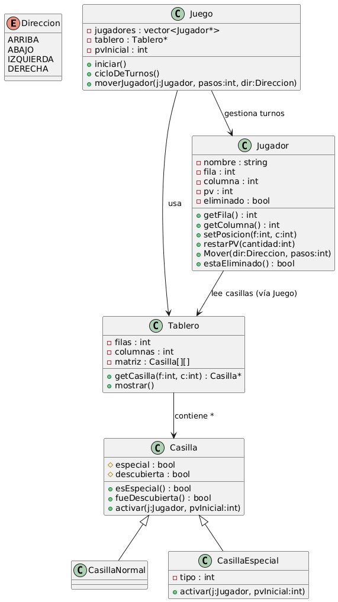

# 🧩 Proyecto POO – Juego de Tablero por Turnos

Este proyecto corresponde a la materia de **Programación Orientada a Objetos (POO)**.  
El objetivo es diseñar e implementar un **juego de tablero por turnos**, usando principios sólidos de POO, manejo de archivos, UML y estructuras dinámicas.

##🎮 Autores:
Esteban Rodríguez Caicedo – 2477126 // Juan Giraldo – 2477082
---

## 🎮 Descripción General del Juego

El juego consiste en un tablero de tamaño fijo donde varios jugadores se desplazan por turnos.  
Cada jugador:

- Tiene puntos de vida (PV) según la dificultad.
- Lanza dados para determinar cuántos pasos avanza.
- Se mueve en 4 direcciones posibles.
- Interactúa con casillas especiales que pueden afectar sus PV.
- Puede ser eliminado si su PV llega a 0.
- El último jugador sobreviviente gana.

---

## 🧱 **Características principales**

### ✔️ **Tablero dinámico**
- Representado como una matriz de punteros a `Casilla`.
- Cada casilla puede ser normal o especial.
- Las casillas especiales pueden **sumar o restar PV**, o realizar un efecto personalizado.

### ✔️ **Jugadores**
- Cada jugador tiene nombre, posición `(fila, columna)` y PV.
- Se muestran directamente en el tablero mediante iniciales (`[J]`).
- Cada movimiento resta PV proporcional a los pasos dados.
- Los jugadores eliminados se omiten en turnos.

### ✔️ **Sistema de turnos**
- Turnos rotativos.
- Elección de dirección y avance basado en dados.
- Se verifica validez del movimiento.

### ✔️ **Dificultades**
- Fácil → 15 PV  
- Medio → 23 PV  
- Difícil → 31 PV  

### ✔️ **Guardado y carga de partida**
- Se almacena el estado en un archivo `.txt`.
- Incluye:
  - PV de cada jugador
  - Posiciones
  - Estado del tablero
  - Turno actual

---

## 📂 **Estructura del Proyecto**
/src
├── main.cpp
├── Juego.cpp / Juego.h
├── Tablero.cpp / Tablero.h
├── Casilla.cpp / Casilla.h
├── Jugador.cpp / Jugador.h
└── Utilidades...

El diagrama UML del proyecto incluye las clases:

- **Juego**
- **Tablero**
- **Casilla** (base)
- **CasillaEspecial** (derivada)
- **Jugador**

## Diagrama UML

